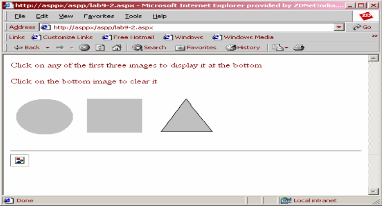

# Exercise 02
Write a program to display three images in a line. When any one of the images is clicked, it must be
displayed below. On clicking the displayed image it must be cleared. The screen must look as in the
figure given below:
